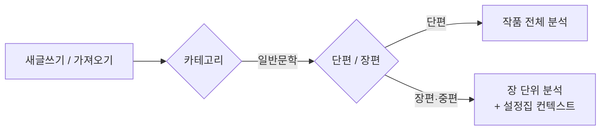

# 슈퍼토리 일반문학 피드백 파이프라인 설계

Sep 23, 2026 · @Someone

## 개요

일반문학 피드백은 기존 파이프라인 뼈대(규칙 검사 → AI 리포트 → AI 교정 카드 → 저장 전 검증)를 그대로 쓰고, 장르별 설정층(규칙 세트, 루브릭, 프롬프트, 검증 기준)만 갈아끼운다. 히스토리, 수집, 중요도별 표시, 더 보기 UI와 저장 구조는 웹소설과 공유한다.

목표가 다르다. 웹소설은 "더 잘 읽히게", 일반문학은 "작가가 의도한 대로 작동하게"가 목표다. 일반문학에서 가장 큰 위험은 AI가 긴 문장을 자르고, 모호함을 풀고, 반복을 지워 문체를 평평하게 만드는 것이다. 파이프라인 전체를 이 위험을 막는 방향으로 조정한다.

| 단계 | 웹소설 | 일반문학 |
| --- | --- | --- |
| 0. 문체 프로필 | 없음 | 추가: 작가 문체를 먼저 파악 |
| 1. 규칙 검사 | 확정 문제로 처리 | 대부분 신호로 격하 |
| 2. 리포트 | 가독성, 전개 속도, 후킹 | 시점, 장면/요약, 함축, 구조 |
| 3. 교정 카드 | 수정안 중심 | 수정안 카드 + 지적형 카드 |
| 4. 검증 | 이름/용어 필터 | + 문체 이탈 검사 |

## 구현 확정 사항

코드 조사 결과를 반영해 설계를 조정한 내용이다. 이 문서의 다른 섹션과 다르면 이 섹션을 따른다.

### 적용 대상

- `cluster_id=general_literature` 중 일반문학, 순문학(`main_genre`의 `general_lit` / `literary`). 에세이는 제외하며 이후 별도 트랙으로 다룬다.
- 판별은 `literary_track(project)` 하나로 한다. 반환값 `short` / `long` / `None`.
- `project.literary_form`(NULL | `short` | `long`). 예전 분량 태그(`sub_genre`의 `mid`/`long`)는 데이터를 유지하되, 단편/장편이 정해진 작품에서는 화면에 단편/장편만 표시한다.
- 기존 작품(`literary_form` NULL)은 그대로 열리고, 장르·키워드에서 단편/장편을 고르라는 안내가 나온다. 고르기 전까지 이후 단계 기능은 잠긴다.

### 피드백 실행과 카드: 기존 첨삭 파이프라인 확장

새 저장소를 만들지 않는다. `feedback_pipeline`(러너, Sonnet 5 클라이언트, 비용 상한)과 `feedback_run` / `feedback_card`를 확장한다.

- `feedback_run`에 파이프라인 구분(예: `literature_short`, `literature_long`)을 추가한다. 현재 `run_kind` CHECK 마이그레이션이 필요하다.
- `feedback_card`에 형식(수정안/지적형), 유형 태그, 중요도, 출처 진단 항목, 의도 가능 표시를 추가한다.
- 카드 상태 `ignored`는 거절 기반 의도적 선택 제안의 셈에 쓴다. `applied_edited`는 적용으로 본다.
- 히스토리는 작품 단위라 문학 작품에서는 문학 실행만 쌓인다.

### 설정집 쓰기: pending 방식

실제 토리 표식은 전각 `〔토리〕`이며, 이탤릭은 칸 전체에 적용된다. 작가가 고치면 접두사가 빠져 작가 글이 된다. 기존 글 뒤에 블록을 덧붙이는 경로는 없으므로, 파이프라인의 설정집 쓰기는 다음을 따른다.

| 상황 | 동작 |
| --- | --- |
| 빈 칸 | `〔토리〕`로 채운다 |
| 새 인물 등 새 항목 | 새 행으로 추가한다 |
| 찬 칸과 다른 내용 | 기존 pending 테이블에 넣고 토리 알림으로 알린다 |

- 찬 칸은 작가 글이든 `〔토리〕` 글이든 파이프라인이 고치지 않는다.
- "토리야 작성해줘"가 기존 `〔토리〕` 글을 덮어쓰는 현재 동작은 작가가 직접 요청한 것이므로 유지한다.
- 파이프라인은 `worldbuilding_md`를 다시 쓰는 compose 경로를 쓰지 않는다.

### 문체 항목: 칸 6개

문서 하나가 아니라 칸 6개로 저장한다(1단계 구현 완료). 1\~4번은 `〔토리〕` 규칙을 따르고 5\~6번은 작가만 쓴다. 토리 자동 작성은 단편 리포트 단계의 문체 추출과 함께 구현한다. 가져오기 끝의 기존 `start_character_analysis_job`은 그대로 두고, 문학 작품일 때만 문체 추출 잡을 추가로 호출한다.

### 장편 요약 캐시

기존 `scene_summary`(`summarize_scene_for_index`, JSON: 이벤트 요약, 인물, 세계관 사실, 떡밥)를 파이프라인 전용 요약 캐시로 쓴다. 장 내용 변경 시 재생성 장치가 있는지 확인이 필요하다.

### 토리 알림 인프라

기존 알림은 떡밥 전용이거나 localStorage에만 저장돼 파이프라인 알림을 담을 수 없어 새로 만든다.

- 서버 테이블: kind, title, body, payload(문맥), actions(선택지), status(unread / read / resolved / dismissed / snoozed), snooze\_until, dedupe\_key.
- 선택지 type: `navigate`(원고 위치 또는 설정집 칸으로 이동, prefill 초안 지원), `resolve`, `snooze`, `dismiss_forever`(같은 dedupe\_key로 다시 만들지 않음).
- 기존 `getUnifiedToryNotifs`에 합쳐 표시한다. 떡밥 알림 모달과 localStorage 수동 알림은 바꾸지 않는다.

### 프롬프트와 UI

- `prompt_pipelines.py`에 문학용 id 상수를 추가했다. `prompt_pipeline_id()` 동작은 유지되어 문학 도우미는 당분간 웹소설 프롬프트를 쓴다.
- 문학 클러스터는 `CLUSTER_HIDDEN_FEATURES`로 흥행, 템포, 떡밥 등을 이미 숨기고 있다. 남은 UI 작업은 장편에서만 떡밥 모음을 "모티프·복선"으로 다시 보이게 하는 것이다.

### 구현 순서와 진행 상태

- [x] 1단계 기반: 단편/장편 필드, 새글쓰기·가져오기·설정 UI, 문체 칸 6개, 문학 프롬프트 id
- [x] 2단계 토리 알림 인프라 (tory\_notification, 선택지 4종, dedupe\_key, 1단계 보완 포함)
- [ ] 3단계 단편 리포트: 첨삭 러너에 문학 단편 파이프라인, 문체 추출, 장면 지도, 리포트
- [ ] 4단계 단편 교정 카드: 카드 필드 확장, 수정안/지적형, 문체 이탈 검증
- [x] 5단계 장편: `scene_summary` 활용, 설정집 pending·알림 연동, 모티프·복선 표시 (5-B 리포트·카드·출력 축소·중간 점검 전 보완 포함)
- [x] 6단계 작품 중간 점검
- [x] 7단계 거절 기반 의도적 선택 제안

## 작품 생성과 트랙 분기

새글쓰기와 가져오기 모두, 카테고리에서 일반문학을 고르면 단편/장편 선택이 나타나고 필수로 고른다. 선택지 아래에 "중편은 장편을 권장합니다" 안내를 둔다. 중편을 통째로 분석하면 뒷부분 분석이 얕아지고 비용이 커지기 때문이다.

- **단편 가져오기**: 원고 전체를 한 편으로 가져온다.
- **장편 가져오기**: 장 구분 후 설정집 자동 작성을 진행하고, 진행 상황을 보여준다. 끝나면 설정집 검토를 유도한다.
- **분량 불일치**: 단편을 골랐는데 분량이 지나치게 크면 확인 메시지를 띄운다.
- **트랙 변경**: 작품 설정에서 허용한다. 단편→장편은 장편용 설정집 작성을 새로 돌리고, 장편→단편은 설정집을 지우지 않고 장편 전용 기능만 멈춘다.

두 트랙은 0단계(문체 프로필)와 4단계(검증)를 공유하고, 분석 단위와 리포트, 컨텍스트 관리가 갈라진다.

## 설정집 연동 원칙

작품 메모리는 새로 만들지 않고 기존 설정집을 쓴다. 파이프라인 규칙은 "설정집은 전부 읽고, 새 내용은 추가만 하고, 기존 내용은 절대 고치지 않으며, 충돌은 알림으로"이다.

설정집 박스 안에는 작가 글과 \[토리\] 글(이탤릭)이 함께 들어간다. 작가는 \[토리\] 글이 마음에 들면 그대로 두고, 아니면 직접 고친다. 따라서 박스 내용 전체가 곧 작품 설정이며, 작성자를 구분하지 않는다.

| 상황 | 파이프라인 동작 |
| --- | --- |
| 읽기 | 박스 내용 전체를 구분 없이 작품 설정으로 사용 |
| 박스 안 내용끼리 엇갈림 | 어느 쪽이 맞는지 추측하지 않고 토리 알림으로 알림 |
| 새 정보 발견 (새 인물, 새 떡밥) | 빈 칸은 〔토리〕로 채우고 새 항목은 새 행으로 추가 (구현 확정 사항 참고) |
| 원고와 설정집 충돌 | 토리 알림에서 "원고를 고친다 / 설정집을 고친다" 선택. 설정집 선택 시 해당 위치로 이동해 작가가 직접 수정 |
| 앞 회차 수정 | 기존 블록을 재작성하지 않음. 관련 항목을 찾아 "○회차가 바뀌어 설정과 달라졌을 수 있습니다" 알림 |

### 기존 기능 대응

| 필요한 요소 | 슈퍼토리 기존 기능 |
| --- | --- |
| 인물 시트 | 설정집 > 캐릭터 |
| 모티프·복선 목록 | 설정집 > 떡밥 모음 |
| 장별 줄거리 요약 | 회차 요약 |
| 이름/용어 필터 기준 | 설정집 > 토리 사전 |
| 작품 의도 | 설정집 > 작품소개·기획의도 |
| 모순 검사 | 설정 붕괴 감지기 (카드 단계에서 로직 재사용) |
| 문체 프로필 | 없음 → 설정집에 "문체" 항목 신설 |

### 문체 항목 (신설)

기획의도는 작품이 무엇에 관한 것인지, 문체 항목은 어떻게 쓰는지를 담는다. 일반문학 가져오기 시 자동 작성 대상에 포함한다. 세부 구성은 아래 "설정집 문체 항목" 섹션 참고.

### 가져오기 시 자동 작성 범위

- **단편**: 문체, 작품소개·기획의도, 캐릭터 중심. 떡밥 모음, 아이템처럼 장편·장르물용 항목은 건너뛴다.
- **장편**: 기존처럼 전부 작성하고, 떡밥 모음은 "모티프·복선"으로 표시한다.

## 설정집 문체 항목

문체 항목은 고정 소제목 6개로 구성한다. 작가와 토리가 같은 소제목 아래 쓰고, 파이프라인은 소제목 단위로 읽어 각 단계에 넘긴다. 1\~4는 토리가 원고에서 추출해 \[토리\] 글로 채우고, 5\~6은 작가만 채운다. 빈 칸에는 "일부러 한 선택이 있다면 적어주세요" 같은 안내 문구만 보인다.

| 소제목 | 내용 | 작성 |
| --- | --- | --- |
| 1. 서술 기본값 | 인칭·시점, 시제(혼용 시 규칙), 서술 종결체, 서술 거리, 다중 시점이면 시점 변화 규칙 | 토리 + 작가 |
| 2. 문장 | 문장 길이 경향, 문단 길이, 쉼표·접속 방식, 종결어미 특징, 문장부호 습관 | 토리 + 작가 |
| 3. 대화 | 대화 비중, 따옴표 사용 여부, 화자 표시 방식, 사투리·구어 | 토리 + 작가 |
| 4. 어휘와 이미지 | 어휘의 결, 한자어·고유어 비중, 비유 밀도, 자주 쓰는 감각·이미지 | 토리 + 작가 |
| 5. 의도적 선택 | AI가 문제로 볼 수 있지만 일부러 한 것. 예: "독백의 구절 반복은 리듬을 위한 의도" | 작가만 |
| 6. 고치고 싶은 습관 | 작가가 알고 있는 나쁜 습관. 예: "'\~것이다'를 줄이고 싶다" | 작가만 |

### 파이프라인에서의 쓰임

| 소제목 | 단계 | 역할 |
| --- | --- | --- |
| 서술 기본값 | 리포트, 검증 | 시점 이탈 판정 기준, 수정안의 인칭·시제·종결체 일치 검사 |
| 문장 | 규칙 검사, 검증 | 규칙 기준값을 작가 경향에 맞게 보정, 수정안 길이 급변 검사 |
| 대화 | 규칙 검사, 카드 | 작가의 대화 방식(따옴표 없는 대화 등)을 오류로 보지 않음 |
| 어휘와 이미지 | 카드 | 수정안의 어휘 결을 작가에 맞춤 |
| 의도적 선택 | 전 단계 | 해당 항목은 카드로 만들지 않음 |
| 고치고 싶은 습관 | 규칙 검사, 카드 | 해당 신호를 카드로 승격, 중요도 상향 |

의도적 선택의 예외: 카드로는 지적하지 않지만, 리포트에서는 "의도는 알지만 이 장면에서는 전달이 잘 되지 않습니다"라고 말할 수 있다. 의도를 존중하는 것과 의도가 작동하는지 알려주는 것은 다른 일이다.

### 수치와 갱신

- 박스에는 "짧은 문장 위주, 긴장 장면에서 더 짧아짐"처럼 경향만 문장으로 적는다.
- 평균 문장 길이, 대화 비중 같은 수치는 파이프라인 실행 때마다 원고에서 다시 계산한다.
- 장편에서 문체가 중간에 달라지면 박스를 고치지 않고 토리 알림으로 알린다. 의도한 변화라면 작가가 의도적 선택 칸에 적는다.

### 거절 기반 의도적 선택 제안

같은 유형의 카드를 반복해 거절하면 토리 알림으로 의도적 선택 추가를 제안한다. 자동 추가는 하지 않는다.

- **전제**: 교정 카드마다 유형 태그(반복 표현, 번역투, 문장 분리, 시점 이탈 등)를 붙인다. 카드 생성 단계 출력 형식에 포함한다.
- **셈 규칙**: 명시적으로 미적용 표시한 카드만 센다. 더 보기를 열지 않은 카드, 넘긴 카드는 제외. 수정안을 고쳐 적용하면 적용으로 본다. 히스토리에서 나중에 적용으로 바꾸면 셈에서 빠진다.
- **조건**: 같은 유형이 서로 다른 피드백 실행 2회 이상에 걸쳐 3번 이상 거절.
- **알림**: "최근 피드백에서 '반복 표현' 제안을 3번 적용하지 않으셨어요. 의도적인 선택이라면 문체의 '의도적 선택'에 추가할까요?" + 거절한 카드 원문 2\~3개.
- **추가**: 의도적 선택 칸이 열리고 초안 문장이 채워져 있어 작가가 다듬어 저장한다. 초안은 거절 카드 전부에 공통된 패턴 범위만 쓰고, 특정 인용 구절·이유·해석은 넣지 않는다. 끝에 `(이유: )` 빈 칸을 두어 작가가 채운다. 인칭은 「화자」.
- **아니요**: 그 유형은 다시 묻지 않는다.
- **나중에**: 다음 조건 충족 시 다시 묻는다.

후순위: 반대로 특정 유형을 꾸준히 적용하면 "고치고 싶은 습관에 추가할까요?"를 제안하는 기능.

## 단계별 설계

| 단계 | 단편 | 장편 |
| --- | --- | --- |
| 0. 문체 프로필 | 작품 전체에서 추출 | 초반 몇 장에서 추출, 이후 보정 |
| 1. 규칙 검사 | 공통 (신호로 격하) | 공통 (신호로 격하) |
| 2. 리포트 | 작품 전체 구조 중심 | 장 + 작품 내 역할 |
| 3. 교정 카드 | 작품 전체 대상 | 해당 장 대상, 모순 검사 추가 |
| 4. 검증 | 공통 (문체 이탈 검사) | 공통 (문체 이탈 검사) |
| 추가 요소 | 버전 비교 | 설정집 컨텍스트 |

**0. 문체 프로필.** 교정 전에 원고에서 문체 특징을 뽑아 설정집 문체 항목에 저장한다. 작가의 "의도적 선택" 메모가 이후 모든 단계의 판단 기준이 된다.

**1. 규칙 검사.** 반복어, 번역투(\~의, \~적, \~것이다), 부사 과다, 피동 등은 카드로 바로 만들지 않고 2\~3단계의 입력 신호로만 넘긴다. 기준은 절대값이 아니라 작가 본인의 문체 대비로 잡는다.

**2. 리포트.** 트랙별 세부는 아래 섹션 참고.

**3. 교정 카드.** 두 종류로 나눈다.

- **수정안 카드**: 의미가 잘못 전달되거나 시점이 이탈하는 등 비교적 객관적인 문제.
- **지적형 카드**: 수정안 없이 지적과 질문만. 예: "이 반복이 의도라면 유지하세요. 아니라면 리듬이 늘어집니다." 리듬, 표현 등 취향 영역에 쓴다.

같은 작품(단편) 또는 같은 단위(장편)의 이전 성공 실행이 있으면 문단 해시로 비교한다. 문단이 그대로인 open 카드는 선별 후보에 이어받고, ignored·applied는 같은 문장·유형을 다시 만들지 않는다. 문단이 바뀐 곳만 새로 탐지한다. 탐지·선별 호출은 모델이 허용하면 temperature 0으로 고정한다(Sonnet 5 등은 샘플링 잠금으로 temperature 미지원).

중요도 상위는 의미 오독 가능성, 시점·문체 이탈이고, 취향 영역은 하위다. 맞춤법·띄어쓰기는 기존 결정대로 카드에서 제외한다.

**4. 검증.** 기존 이름/용어 필터와 "AI 검사, 확인 필요" 라벨을 유지하고 문체 이탈 검사를 추가한다. 수정안의 시제, 종결어미, 인칭이 문체 항목과 맞지 않거나, 이유가 "가독성 향상"뿐인데 문장을 크게 줄인 카드는 걸러내거나 지적형 카드로 바꾼다.

## 단편 트랙 리포트 단계

단편 리포트는 작품 전체를 한 번에 읽고, 작품이 하려는 것이 제대로 작동하는지 본다.

### 입력

원고 전체, 설정집 박스 내용 전체(특히 문체, 작품소개·기획의도), 1단계 규칙 신호, 작가 지침, 이전 리포트(있을 때).

### 처리: 두 번에 나눠 읽기

1. **장면 지도**: 원고를 장면 단위로 나누고 장면마다 시점 인물, 시간·장소, 등장인물, 한 줄 요약, 장면/요약 서술 여부를 뽑는다. 첫 문장, 마지막 문장, 반복 이미지·모티프도 정리한다. 카드 단계와 버전 비교의 기준점으로 재사용한다.
2. **루브릭 평가**: 장면 지도와 원고 전문으로 아래 항목을 판정한다.

| 항목 | 보는 것 |
| --- | --- |
| 도입 | 첫 문장과 첫 장면이 톤과 긴장을 세우는가 |
| 시점·서술 거리 | 의도 없이 흔들리는 곳이 있는가 |
| 장면과 요약 | 중요한 순간이 요약으로 지나가거나 사소한 부분이 늘어지지 않는가 |
| 인물 | 욕망과 변화가 보이는가, 내면이 구체적인가 |
| 이미지·모티프 | 반복 이미지가 변주되며 의미를 쌓는가 |
| 함축 | 설명하지 않아도 될 것을 설명하지 않는가 |
| 결말 | 도입과 호응하는가, 의미를 다 풀어버리지 않는가, 급하게 닫히지 않는가 |
| 경제성 | 빠져도 성립하는 장면이나 인물이 있는가 |
| 문체 일관성 | 문체 항목과 어긋나는 구간이 있는가 |
| 제목 | 제목이 작품과 어떤 관계를 맺는가 |
| 새로움 (공모전 토글 시) | 소재, 구도, 결말 처리가 흔한 방식인가 (참고 의견 표시) |

판정은 점수 없이 "잘 작동함 / 보완 여지 / 문제" 3단계. 모든 판정에 근거 위치(장면 번호 + 짧은 인용)를 붙이고, 문체 항목이나 기획의도상 의도적일 수 있으면 "의도라면 유지" 표시를 붙인다.

### 출력 구성 (표시 순서)

1. **총평**: 페르소나 톤은 여기서만. 독자(몰입과 감정), 편집자(구조와 경제성), 비평가(의미와 성취), 공모전 토글 시 심사위원.
2. **토리가 읽은 이 작품**: "이 작품은 \~에 관한 이야기로 읽힙니다"로 AI의 해석을 제시하고, 기획의도와 어긋나는 지점을 짚는다.
3. **강점**: 퇴고하면서 지켜야 할 것, 위치 포함.
4. **항목별 진단**: 보완·문제 항목을 먼저 펼치고 "잘 작동함"은 접는다.
5. **우선 퇴고 과제 3개**: 작품 전체에 영향이 가장 큰 것.
6. **교정 카드 총 개수**: 리포트 본문을 먼저 보여주고 카드 생성이 끝나면 채운다.
7. **이전 버전과 비교** (이전 리포트가 있을 때): 이전 진단마다 해결됨 / 부분 해결 / 그대로 / 새로 생김 표시. "토리가 읽은 이 작품"이 달라졌으면 함께 알린다.

### 카드 단계와의 연결

문장·문단으로 좁혀지는 진단은 교정 카드의 씨앗으로 넘기고 카드에 출처 진단 항목을 연결한다. 구조, 결말처럼 문장 단위로 고칠 수 없는 진단은 리포트에만 남긴다. 리포트는 작품 단위, 카드는 문장 단위.

### 리포트 검증

- 모든 근거 인용이 실제 원고에 존재하는가 (없으면 제거)
- 리포트 안에 수정 문장을 직접 써넣지 않았는가
- 규칙 신호만 보고 문체 항목과 충돌하는 지적을 하지 않았는가

### 테스트 관점

"토리가 읽은 이 작품"의 정확도, 근거 위치의 정확도, 의도적 문체를 문제로 지적하는 빈도. 마지막이 일반문학 트랙에서 가장 흔한 실패 유형일 가능성이 크다.

## 단편 트랙 교정 카드 단계

카드는 문장 단위이며, 원칙은 "문체를 해치지 않고 고칠 수 있는 것만 고친다"이다.

### 입력

원고, 장면 지도와 리포트 진단, 1단계 규칙 신호, 설정집 문체 항목, 기획의도, 토리 사전.

### 후보 생성: 두 경로

- **리포트 씨앗**: 위치로 좁혀지는 진단을 카드로 풀고, 출처 진단 항목을 연결한다.
- **장면별 정밀 읽기**: 장면 단위로 나눠 문체 항목과 앞뒤 장면 요약을 함께 넣고 병렬로 돌린다. 한 번에 전체를 넣으면 뒷부분 카드가 얕아지기 때문이다.

### 수정안 카드와 지적형 카드

기준: AI가 작가의 목소리로 새 문장을 지어내지 않고도 고칠 수 있는가. 정답에 가까운 문제는 수정안, 작가가 답을 가진 문제는 지적형.

| 유형 태그 | 기본 형식 | 이유 |
| --- | --- | --- |
| 의미 모호·오독 가능 | 수정안 | 최소 수정으로 해결 |
| 시점 이탈 | 수정안 | 문체 항목의 시점 규칙이 기준 |
| 문체 이탈 (시제·종결체) | 수정안 | 문체 항목에 맞추면 됨 |
| 비문 (문장 구조 오류) | 수정안 | 정답에 가까움 |
| 과잉 설명 | 수정안 (삭제 제안) | 새 문장 없이 빼는 것만 |
| 반복 표현 | 지적형 | 리듬 의도일 수 있음 |
| 번역투 | 지적형 | 문체 선택일 수 있음 |
| 상투적 표현 | 지적형 | AI 대안도 상투적일 가능성 |
| 리듬·문장 길이 | 지적형 | 취향 영역 |
| 감각·이미지 약함 | 지적형 | 작가가 채울 부분 |

- 고치고 싶은 습관에 적힌 유형은 수정안 카드로 승격, 의도적 선택에 해당하면 카드를 만들지 않는다.
- 지적형 카드에 "토리에게 수정안 요청" 버튼을 둔다. 요청 기록은 작가 선호 신호로 쓴다.

### 카드 구성

위치(문장 앵커), 유형 태그, 형식, 중요도, 이유, 수정안(있을 때), 출처 진단 항목, "의도라면 유지" 표시(해당 시), "AI 검사, 확인 필요" 라벨.

### 중요도

| 등급 | 대상 |
| --- | --- |
| 상 | 의미 오독, 시점 이탈, 문체 이탈, 비문, 우선 퇴고 과제 3개에서 나온 카드 |
| 중 | 과잉 설명, 고치고 싶은 습관 해당 카드 |
| 하 | 반복, 번역투, 리듬, 상투 표현 등 취향 영역 지적형 카드 |

상위부터 보여주고 나머지는 더 보기, 목록은 항상 원고 순서.

### 문체 이탈 방지

**생성 원칙**: 수정 범위는 문제가 있는 최소 구간, 작가의 단어는 최대한 유지, 종결체·시제·인칭은 문체 항목대로. 이유 없는 축약, 새 비유·이미지 추가, 설명 덧붙이기 금지.

**저장 전 검사**:

1. 종결어미와 시제가 원문 및 문체 항목과 일치하는가 (규칙 기반)
2. 국소 문제인데 문장 대부분을 바꿨는가 → 지적형으로 강등
3. 유형이 과잉 설명이 아닌데 길이가 크게 줄었는가 → 강등
4. 토리 사전의 이름·용어가 보존됐는가
5. 원문 의미가 유지됐는가 (짧은 AI 판정)
6. 의도적 선택에 해당하는 카드가 섞였는가

걸러진 카드는 버리지 않고 지적형으로 바꿔 살리는 것이 기본값이다.

### 중복 정리

같은 문장의 카드는 하나로 합치고 유형 태그를 함께 표시한다. 리포트 전용 구조 진단과 겹치는 카드는 만들지 않는다.

## 심사위원 관점과 공모전 준비 토글

총평에 네 번째 관점으로 심사위원을 추가한다. 비평가는 "이 작품이 무엇을 이뤘는가"를 해석하고, 심사위원은 "다른 응모작들 사이에서 살아남는가"를 본다.

| 심사위원이 보는 것 | 설계 |
| --- | --- |
| 첫 몇 페이지의 힘 | 도입 항목 판정을 예심 관점에서 다시 언급 |
| 새로움과 기시감 | 루브릭에 "새로움" 항목 추가. AI 판단이 최근 응모 경향을 보장하지 않으므로 참고 의견으로 표시 |
| 기본기 | 기존 맞춤법 검사기 결과 개수를 신호로 받아 "기본 교정이 필요한 수준"인지만 언급 (카드와 역할 분리) |
| 분량 규정 | 1단계 규칙 검사에서 원고지 매수를 계산해 규정 범위와 비교 |

**형식과 톤.** 실제 공모전 심사평처럼 짧고 냉정하게. 좋은 점 하나와 결정적 약점 하나, "본심에 올린다면 이유는 \~, 당선작이 되려면 \~가 필요하다" 구조.

**원칙.** 당선 가능성을 퍼센트나 등급으로 예측하지 않는다.

**노출 방식.** 작품 설정에 "공모전 준비 중" 토글과 목표 공모전(선택 입력, 분량 규정 포함)을 둔다. 토글이 켜졌을 때만 심사위원 관점과 새로움·분량 항목이 나온다. 단편, 장편 모두에 적용한다. 토글이 켜진 작품에서는 도우미의 "투고·공모전용 시놉시스"를 목록 위쪽으로 올린다.

## 장편 트랙 리포트 단계

장편 리포트는 "이 장이 그 자체로 잘 쓰였는가"와 "이 장이 작품 안에서 제 역할을 하는가"를 함께 본다. 단편 리포트의 뼈대를 쓰고 아래가 달라진다.

### 입력

해당 장 원고, 설정집 박스 내용 전체, 이전 장 요약, 직전 장 마지막 장면 원문(다음 장이 있으면 그 첫 장면도), 문체 항목, 규칙 신호, 작가 지침, 같은 장의 이전 리포트.

- **파이프라인 전용 요약 캐시**: 작가가 보는 회차 요약과 별개인 기존 scene\_summary를 쓴다. 장 내용이 바뀌면 그 장의 요약만 자동 재생성한다. 작가가 볼 수 있는 내용을 파이프라인이 고치지 않는 원칙을 지키기 위해서다.
- **계층 압축**: 최근 몇 장은 자세한 요약, 그 이전은 여러 장을 묶은 요약으로 넣는다.

### 처리

1. **장면 지도와 "이 장이 한 일"**: 새 사건, 인물 변화, 새로 등장하거나 다시 나온 모티프·복선, 회수된 복선. 요약 캐시와 함께 다음 장 분석과 중간 점검에 쓰인다.
2. **루브릭 평가**

| 묶음 | 항목 | 보는 것 |
| --- | --- | --- |
| 장 내부 | 시점·서술 거리, 장면과 요약, 인물 내면, 함축, 문체 일관성 | 단편과 같은 기준 |
| 작품 속 이 장 | 앞 장과의 연결 | 시간, 감정, 사건이 끊기거나 급하게 건너뛰지 않는가 |
| 작품 속 이 장 | 이 장의 역할 | 작품 안에서 하는 일이 분명한가 |
| 작품 속 이 장 | 인물 일관성 | 설정집 캐릭터 대비 모순 (설정 붕괴 감지기 로직) |
| 작품 속 이 장 | 인물 궤적 | 변화가 쌓이는가, 멈춰 있는가 |
| 작품 속 이 장 | 모티프·복선 | 방치, 회수, 새로 깔림 |
| 작품 속 이 장 | 장의 시작과 끝 | 장을 여닫는 방식이 제 역할을 하는가 |

1장에만 도입 항목, 작가가 마지막 장으로 표시한 장에만 결말 항목을 넣는다. 공모전 토글 시 1장 리포트에 심사위원의 첫 몇 페이지 판정이 붙는다.

### 출력 구성

1. 총평 (독자, 편집자, 비평가, 토글 시 심사위원)
2. 토리가 읽은 이 장: 작품 안에서 하는 일, 기획의도와 어긋나는 지점
3. 강점
4. 항목별 진단: 장 내부 / 작품 속 이 장으로 나눔
5. 설정집과의 관계: 발견된 모순(토리 알림으로도 전송), 이번 장으로 설정집에 \[토리\] 글로 추가된 내용
6. 우선 퇴고 과제 3개
7. 교정 카드 총 개수
8. 이전 버전과 비교 (같은 장 재실행 시)

### 리포트 검증: 과거 사실을 지어내지 않게

단편 검증 항목에 더해, 이전 장에 대한 모든 언급은 회차 번호를 달아야 한다. 요약 캐시나 설정집에서 확인되지 않으면 단정 대신 질문으로 바꾼다. 예: "3장에서 왼손잡이로 나온 것 같은데, 맞다면 이 장과 어긋납니다."

### 교정 카드

해당 장 안에서만 만들며, 단편 교정 카드 단계의 기준을 따르고 설정집 기준 모순 카드가 추가된다. 모순 카드는 "원고를 고친다 / 설정집을 고친다" 선택을 준다.

## 작품 중간 점검

매 장 리포트가 나무를 본다면 중간 점검은 숲을 본다. 일반문학 장편에서만 보이는 도우미 기능이다.

### 실행 방식

- 작가가 원할 때 실행하며, 범위(작품 전체 또는 특정 구간)를 고른다.
- 장이 일정 수 쌓이면(예: 10장마다) 토리 알림으로 권하되, 자동 실행은 하지 않는다.

### 입력

원고 전문은 읽지 않는다. 실행 전에 범위 안 단위의 `scene_summary` 중 없거나 낡은 것을 채우고, 장편 리포트「이 장이 한 일」이 없거나 해시가 틀린 단위는 Haiku로 가벼운 장 기록을 만든다(진행 표시는 「앞 장 요약을 준비하는 중 (n/m)」). 장편 리포트의「이 장이 한 일」이 있으면 그것을 우선한다. 이후 이 기록·요약 캐시·설정집·기획의도·문체를 쓴다. 원문 확인이 필요한 판단만 해당 장 관련 구간을 꺼내 확인한다. 가벼운 장 기록이 만들어진 단위에는 「요약만으로 점검했어요」 안내를 붙이지 않는다.

기획의도와의 거리(intent_gap)는 작품소개·기획의도만 근거로 쓴다. 문체 1~4번은 관찰 설명이지 목표가 아니며 평가·퇴고 근거로 쓰지 않는다. 작가의 뜻으로 쓸 수 있는 문체 칸은 의도적 선택·고치고 싶은 습관뿐이다. 설정집에 없는 모티프·복선(두 장 이상 등장)은 「설정집에 없음」과 추가 제안으로 보여 준다.

### 출력 구성

1. **토리가 읽은 지금까지의 작품**: 무엇에 관한 이야기로 읽히는지, 기획의도와 어긋나는 지점
2. **장별 역할 지도**: 장마다 한 일을 한 줄로 정리한 표
3. **인물 궤적**: 주요 인물별 변화, 멈춘 구간
4. **모티프·복선 현황**: 처음 등장 장, 마지막 언급 장, 상태(진행 중 / 회수됨 / 방치 의심 / 열어둔 복선)
5. **반복 패턴**: 비슷한 구조의 장, 같은 유형의 장면 반복
6. **속도**: 사건 밀도와 요약 서술 비중으로 본 늘어지거나 급한 구간
7. **큰 퇴고 방향 3개**: 예: "7\~9장을 하나로 합치는 것을 고려"

교정 카드는 만들지 않는다. 톤은 4관점 대신 편집자 한 명의 목소리로 통일한다.

### 열어둔 복선

작가가 설정집 모티프·복선 항목에 "의도적으로 열어둠"이라고 적으면 방치로 표시하지 않고 "열어둔 복선"으로 분류한다.

### 검증과 저장

모든 판단에 회차 번호를 달고, 요약 캐시나 설정집에서 확인되지 않으면 질문 형태로 바꾼다. 결과는 히스토리와 수집에 남고, 이전 중간 점검과 비교해 복선 현황과 인물 궤적의 변화를 보여준다.

## 일반문학 UI 조정

도우미 목록과 설정집은 웹소설 기준이라, 카테고리가 일반문학일 때 일부를 숨기거나 이름을 바꾼다.

| 대상 | 조정 |
| --- | --- |
| 흥행 공식 피드백, 흥행 공식 분석 | 숨김 |
| 서사 템포 & 훅 분석기 | 숨김 |
| 설정집 > 흥행작 프로파일 연결 | 숨김 |
| 설정집 > 떡밥 모음 | "모티프·복선"으로 표시 (장편) |
| 설정집 > 문체 | 신설 |
| 투고·공모전용 시놉시스 | 공모전 토글 시 목록 위쪽으로 |
| 새글쓰기 / 가져오기 | 일반문학 선택 시 단편/장편 선택 추가 |
| 작품 설정 | 트랙 변경, 공모전 준비 토글, 목표 공모전 입력 |
| 도우미 > 작품 중간 점검 | 신설 (일반문학 장편 전용) |

## 단편 리포트 단계 테스트 계획

오지적을 먼저 잡고 탐지율은 그다음이다. 문체를 망가뜨리는 피드백 한 번이 놓친 지적 몇 개보다 신뢰를 더 크게 잃게 한다.

### 테스트 원고

| 묶음 | 내용 | 측정 목적 |
| --- | --- | --- |
| 잘 쓴 작품 | 저작권 만료 한국 근대 단편 (김유정, 현진건, 이효석, 나도향 등) | 오지적, 개성 강한 문체 존중 |
| 결함 심은 작품 | 시점 이탈 문장, 결말 설명 문단, 끊긴 모티프, 불필요한 장면을 일부러 삽입 | 탐지율 |
| 실제 사용자 원고 | 동의받은 일반문학 작가의 원고 + 기획의도 + 의도적 선택 | "토리가 읽은 이 작품" 정확도, 실사용 가치 |

각 묶음에 문체가 까다로운 원고(따옴표 없는 대화, 현재형 서술, 아주 긴 문장)를 섞는다.

### 조건 조합

- 의도적 선택 비움 vs 채움: 오지적 감소 효과
- 기획의도 있음 vs 없음: "토리가 읽은 이 작품"이 기획의도에 끌려가는지
- 공모전 토글 켜짐 vs 꺼짐: 심사위원 관점과 새로움·분량 항목의 붙고 빠짐

### 측정 항목

| 항목 | 재는 법 | 초기 목표 |
| --- | --- | --- |
| 장면 지도 정확도 | 사람이 나눈 장면과 비교 | 장면 경계 대부분 일치 |
| 토리가 읽은 이 작품 | 작가(또는 팀)가 맞음/부분/틀림 판정 | 맞음+부분 80% 이상 |
| 근거 인용 존재 | 자동 확인 (검증 후) | 100% |
| 근거와 판정의 연결 | 인용이 판정을 뒷받침하는지 사람이 판정 | 대부분 타당 |
| 의도적 문체 오지적 | 의도적 선택·문체 특징을 문제로 지적한 횟수 | 의도 채움 시 작품당 1건 이하 |
| 심은 결함 탐지율 | 결함을 맞는 항목으로 잡은 비율 | 70% 이상 |
| 재현성 | 같은 입력 3회 실행 시 판정 일치 | 잘 작동함 ↔ 문제 뒤집힘 없음 |
| 버전 비교 | 결함 버전 → 수정 버전 순으로 실행 | 고친 결함 대부분 해결됨 |
| 형식 준수 | 점수, 리포트 내 수정 문장, 당선 예측 여부 | 위반 0건 |
| 비용·시간 | 원고지 100매 기준 토큰, 소요 시간 | 기준값 기록 |

목표 수치는 첫 실행 후 조정할 출발점이다. 오지적과 탐지율은 서로 당기는 관계다.

### 진행 순서

1. 장면 지도 단독 테스트: 분할이 흔들리면 먼저 고친다
2. 루브릭 평가 테스트: 결함 원고로 탐지율, 잘 쓴 작품으로 오지적
3. 전체 출력 테스트: 실제 사용자 원고로 작가 평가
4. 버전 비교 테스트

리포트 단계 모델은 미정이므로 이 테스트에서 후보 모델을 같은 조건으로 함께 돌려 비교한다. (카드 생성은 Sonnet 5로 결정됨)

## 남은 설계 과제

문체 항목은 리포트, 카드, 검증이 모두 기준으로 쓰므로 가장 먼저 잡는다.

- [x] 설정집 문체 항목의 구체적 구성
- [x] 단편 트랙 교정 카드 단계 (수정안/지적형 구분 기준, 문체 이탈 방지)
- [x] 장편 트랙 리포트 단계 세부 설계
- [ ] 단편 리포트 단계 테스트 실행 (계획은 위 섹션)
